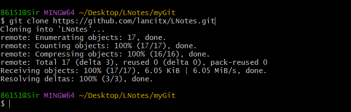
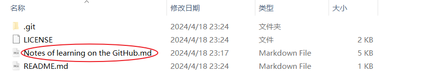
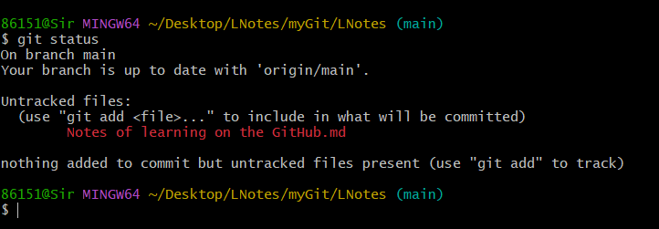
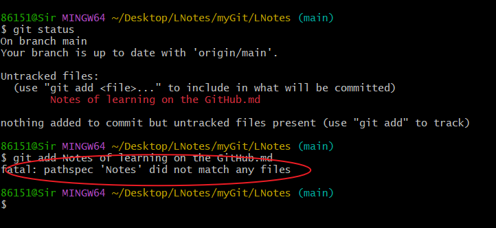
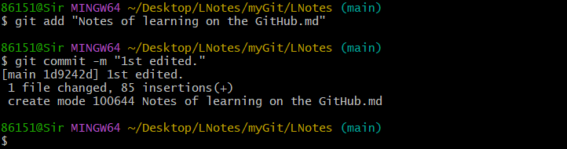
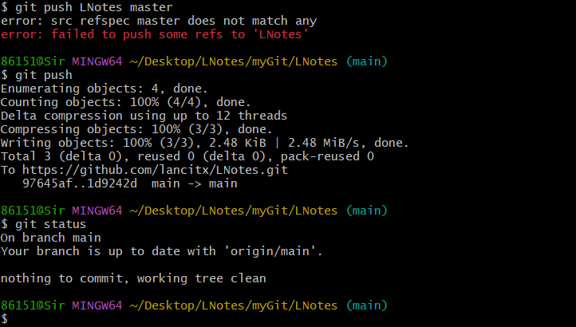

# Notes of learning on the GitHub

**书山有路勤为径，学海无涯苦作舟。**


## 1. GitHub的几种许可

- **MIT许可证：**
  MIT许可证是一种非常宽松的许可证，**允许任何人使用、修改、分发代码**，甚至可以将代码用于闭源商业项目，只需在代码副本中包含原始版权和许可声明。这使得MIT许可证非常适合需要广泛传播的开源项目。
- **Apache许可证：**
  Apache许可证是一种类似于MIT许可证的开源许可证，但它**还包含了一些专利权方面的条款**，以保护贡献者和使用者免受潜在的专利诉讼。它允许自由使用、修改、分发代码，并在遵循许可证条件的情况下进行专利授权。
- **GNU通用公共许可证（GPL）：**
  GPL是一种“强制性”的开源许可证，要求任何以GPL许可的代码派生作品也必须以GPL许可发布。这意味着**使用或修改GPL许可的代码的项目也必须是开源的，不能将其用于封闭源的商业项目**。GPL确保代码的自由性和共享性，有助于避免闭源的“僵尸代码”。
- **GNU较宽松的公共许可证（LGPL）：**
  LGPL是GPL的变种，更宽松一些。LGPL通常用于库和框架，允许这些库被用于闭源商业应用，但对于对库进行的任何修改，修改的部分必须保持开源并遵循LGPL。
- **Mozilla公共许可证（MPL）：**
  MPL是一种开源许可证，**允许代码与闭源代码混合使用，但要求任何修改的部分必须以MPL许可发布**。这种许可证鼓励代码的共享和改进，同时保护原始作者的权益。
- **GNU Affero通用公共许可证（AGPL）：**
  AGPL是GPL的变种，专门用于网络应用程序。如果你在服务器上运行使用了AGPL许可的代码的修改版网络应用程序，AGPL要求你提供源代码，即使你没有分发应用程序。
- 待补充...

---

## 2. GitHub的常用操作

- **issue**：别人的开源项目有bug，可以提交issue。
- **fork**：拉分支，复制该项目到自己账号，且独立于原项目。
- **Pull Request**：建立在**fork**上，可将自己修改后的项目申请合并（**Merge**）。
- **Watch**：留意某个项目变化。
- **Gist**：开源一些代码片段。
- 待补充...

---

## 3. Git的常见操作

git本地数据管理有三个分区：

- **工作区（Working Directory）**：可以直接编辑的区域，可理解为本地库。
- **暂存区（Stage/Index）**：数据暂时存放的区域，在工作区编辑好后使用`git add`添加到暂存区。
- **版本库（commit history）**：数据最终存放区域，使用`git commit -m “提交信息”`。

### 3.1 库状态查询

- 在windows下，右击**仓库目录**，进入bash，在Linux系统下，直接**cd + 路径**。
- `git status`：查看仓库状态（必须**事先声明该目录为仓库**）。
- `git status -s`：**可选 -s**，精简输出。

| 符号 |         含义         |
| :--: | :------------------: |
| ‘ ’  | 空格，表示文件未变化 |
| `M`  |     文件发生改动     |
| `A`  |       新增文件       |
| `D`  |      文件被删除      |
| `R`  |     文件被重命名     |
| `C`  |         复制         |
| `U`  |   文件更新但未合并   |
| `?`  |      未跟踪文件      |
| `!`  |       忽略文件       |

- `git status -b`：**可选-b**，显示分支。
- `git status -v`：**可选-v**，显示**版本库**与**暂存区**相比较不同的内容。
- `git status -v -v` ：**可选-v -v**，显示**暂存区**与**工作区**相比较不同的内容。
- `git status -u[<model>]`：显示未跟踪文件，**model：no（不显示）、normal（显示文件和目录名）、all（显示文件及目录下的文件）**。
- `git log`：查看仓库的**commit日志**。
- `git remote -v`：查看**远程库信息**。

### 3.2 添加文件

- `git init`：初始化仓库，算是声明，需注意在初始化前的目录下文件将显示**untracked files**。

- `git add xx`：添加`xx`文件到暂存区，**并不是真的到仓库**。
- `git add -A .`：添加**所有改变了的文件**到暂存区。
- `git add .`：表示添加**新文件和编辑过的文件，但不包括删除的文件**。
- `git add -u`：表示添加**编辑或者删除的文件，不包括新添加的文件**。

- `git commit -m "提交信息"`：将文件提交到仓库，**并附带备注信息**。

### 3.3 删除文件

- `rm`：删除**工作区**文件，但**并没有删除版本库中文件**，还需要输入`git add XX.txt & git commit -m "delete XX"`。

- `git rm xx`：**删除工作区xx文件**，并将此次删除**放入暂存区**，==**使用该指令需要求与远程库文件一致（无修改）**==，然后commit。
- `git rm -f xx`：**针对工作区中已经修改的xx文件（==不一致==）进行删除**，然后commit。

- `git rm -r xx`：删除**文件夹**。

- `git rm --cache xx`：**删除暂存区xx文件，但不删除工作区xx文件**，然后commit，实现工作区文件保留，其余两个删除。

- `git rm *.txt`：**其中\*是通配符**，用于批量删除同一格式的文件。
- `git rm --cache -r --files-from=filelist.txt`：**使用列表的方法批量删除文件**，其中**filelist.txt**保存待删除文件的路径，各占一行。

- `git filter-branch`：针对上面的删除，git会保留对应记录，使用该指令可以**进行历史记录的重写**。

### 3.4 比较文件差异

- `git diff`：比较**工作区**与**暂存区**的差异，

```C
git diff :查看工作区和暂存区之间所有的文件差异
git diff -- 文件名:查看具体某个文件在工作区和暂存区之间的差异
git diff -- 文件名1 文件名2 文件名:查看多个文件在工作区和暂存区之间的差异
tips："--" 和"文件名"之间有一个空格,"文件名1、文件名2、文件名3"之间也有空格
```

- `git diff HEAD`：比较**工作区**与**版本库**的差异，

```C
git diff HEAD :查看工作区与最新版本库之间的所有的文件差异
git diff 具体某个版本 :查看工作区与具体某个提交版本之间的所有的文件差异
git diff HEAD -- 文件名 :查看工作区与最新版本库之间的 指定文件名的文件差异
git diff HEAD -- 文件名1 文件名2 文件名3 :查看工作区与最新版本库之间的 指定文件名的多个文件差异
git diff 具体某个版本 -- 文件名 :查看工作区与具体某个版本之间的 指定文件名的文件差异
git diff 具体某个版本 -- 文件名1 文件名2 文件名3 :查看工作区与最具体某个版本之间的 指定文件名的多个文件差异
```

- `git diff --cached`：比较**暂存区**和**版本库**的差异，

```C
git diff --cached :查看暂存区和上一次提交的最新版本(HEAD)之间的所有文件差异
git diff --cached 版本号 :查看暂存区和指定版本之间的所有文件差异
git diff --cached -- 文件名1 文件名2 文件名3 :查看暂存区和HEAD之间的指定文件差异
git diff --cached 版本号 -- 文件名1 文件名2 文件名3 :查看暂存区和指定版本之间的指定文件差异
```

### 3.5 分支管理

- `git branch a`：创建**a分支**，同时当分支前显示 * 时，即表示当前分支。
- `git checkout xx`：**切换到xx分支。**
- `git checkout -b xx`：**创建xx分支，并直接进入**。
- `git merge xx`：**将xx分支合并到==当前分支==**，需检查是否冲突。
- `git branch -d xx & git branch -D xx`：**删除xx分支 & 强制删除xx分支**。
- `git tag XXX`：**给当前分支添加标签**，可以用`git tag`显示分支标签。

### 3.6 其它

- `git mv xx dir`：移动xx文件到dir路径。
- `git mv -v oldfile newfile`：**重命名文件名**。

```C
-v：显示信息。

-f：强制重命名或移动，会覆盖目标文件。

-k：跳过对重命名或移动出错的文件。出错的时候发生在源文件不存在，或者没有追踪的源文件，或者目标文件已经存在，但没有加-f进行覆盖。

-n：只显示信息，但不会进行实际重命名或移动操作。
```

- 待补充

---

## 4. 通过Git托管GitHub代码

- 一般使用**SSH将git与github绑定**。
- 一般先进行**pull**，再进行**push**，针对本地无对应**git仓库**有：
- `git clone https://...`：克隆（**pull**）对应仓库件到**选定的目录中**，不用初始化，且自动匹配。
- 此后就可以在本地进行项目管理，然后使用`git add XX`和`git commit -m`**将需要添加的文件加在本地仓库中**。
- 将本地项目**push**到github中，使用`git push origin master`，**origin**是仓库名字，第一次上传需要输入账号和密码：

```c
git config --global user.name"fengye97"
git config --global user.email"***@***.com"
```

- 如果是本地已有Git仓库，且多次**commit**，则：
- 输入`git remote add origin https://..`，关联远程仓库，再输入`git pull origin master`，同步，

---

## 5. 简单演示

- 选定目录进入**bash**，输入`git clone https://..`，克隆远程仓库。



- 在该目录中添加文件，



- 从**目录进入bash**，输入`git status`查看状态，



- 使用`git add Notes of learning on the GitHub.md & git commit -m "1st edited."`，



​		然鹅，我们会发现报错，因为文件带空格，可以使用双引号，



- 使用`git log`查看提交日志，使用**q**退出。
- 再输入`git push origin master`进行同步，其中origin为仓库名，如**origin**，通过`git remote -v`查看，master为分支名，如**main**，使用`git branch`查看，与`git push`不同。



---

## 6. 常见问题

- 上传**md文件后**图片无法正常显示，解决方法：在仓库新建images文件夹上传图片，图片使用相对路径。
- 在github中的README.md文件中**超链接失效**或**渲染失败**：1、在github中编辑，2、使用url链接，3、注意**空格用%20**表示。
- github使用的：`git config --global http.version HTTP/1.1`

